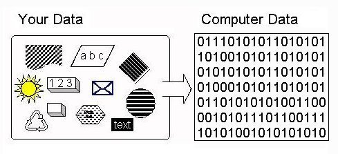
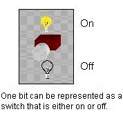
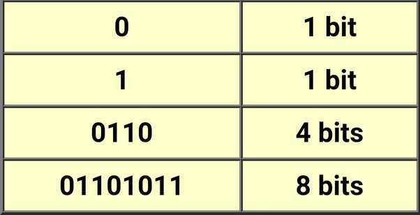
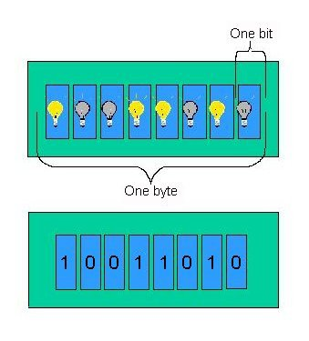

# Learn Basics of Computer 👇

### What is computer ❓

🚀 A computer is an electronic device that processes and stores data, executing tasks through a combination of hardware components, including a central processing unit (CPU), memory, and storage devices.

#### What is Ram ❓

🚀 RAM, or Random Access Memory, is a type of computer memory that provides high-speed access to data and actively used program instructions. Unlike storage devices such as hard drives or SSDs, RAM is volatile and loses its content when the computer is powered off.

#### How does computer store information or data ❓

👉 We have all seen computers do seemingly miraculous things with all kinds of sounds, pictures, graphics, numbers, and text.

👉 It seems that we can build a replica of parts of our world inside the computer.

👉 You might think that this amazing machine is also amazingly complicated - it really is not.

👉 In fact, all of the wonderful multi-media that we see on modern computers is all constructed from simple ON/OFF switches - millions of them - but really nothing much more complicated than a switch.

👉 The trick is to take all of the real-world sound, picture, number etc data that we want in the computer and convert it into the kind of data that can be represented in switches.

Figure 1: Representing Real-World Data In The Computer

🚀 Computers Are Electronic Machines:- The computer uses electricity, not mechanical parts, for its data processing and storage.

🚀 Electricity is plentiful, moves very fast through wires, and electrical parts fail much less frequently than mechanical parts.

🚀 The computer does have some mechanical parts, like its disk drive (which are often the sources for computer failures), but the internal data processing and storage is electronic, which is fast and reliable (as long as the computer is plugged in).

Binary and Switches:- Binary is a mathematical number system: a way of counting. We have all learned to count using ten digits: 0-9.

🚀 One probable reason is that we have ten fingers to represent numbers. The computer has switches to represent data and switches have only two states: ON and OFF.

🚀 Binary has two digits to do the counting: 0 and 1 - a natural fit to the two states of a switch (0 = OFF, 1 = ON).

🚀 The evolution of how switches were built made computers faster, cheaper, and smaller.

🚀 Originally, a switch was a vacuum tube, about the size of a human thumb. In the 1950's the transistor was invented (and won its inventors a Noble Prize).

🚀 It allowed a switch to be the size of a human fingernail. The development of integrated circuits in the 1960s allowed millions of transistors to be fabricated on a silicon chip - which allowed millions of switches on something the size of a fingernail.

Bits and Bytes. One binary digit (0 or 1) is referred to as a bit, which is short for binary digit. Thus, one bit can be implemented by one switch, as shown in Figure 2.

👉 In the following table, we see that bits can be grouped together into larger chunks to represent data.

👉 For several reasons that we do not go into here, computer designers use eight bit chunks called bytes as the basic unit of data. A byte is implemented with eight switches as shown in Figure 3.

#### Figure 3: Implementing a Byte

🚀 Computer manufacturers express the capacity of memory and storage in terms of the number of bytes it can hold.

🚀 The number of bytes can be expressed as kilobytes. Kilo represents 2 to the tenth power, or 1024.

🚀 Kilobyte is abbreviated KB, or simply K. (Sometimes K is used casually to mean 1000, as in "I earned $30K last year.") A kilobyte is 1024 bytes.

🚀 Thus, the memory of a 640K computer can store 640x1024, or 655,360 bytes. Memory capacity may also be expressed in terms of megabytes (1024x1024 bytes). One megabyte, abbreviated MB, means roughly one million bytes.

🚀 With storage devices, manufacturers sometimes express memory amounts in terms of gigabytes (abbreviated GB); a gigabyte is roughly a billion bytes. Computer memory, or RAM, in modern computers might hold 256 MB, or roughly 256 million bytes. Modern computer hard disks hold gigabytes (e.g. 80 GB).

### What is internet ❓

### How internet works ❓

### http vs https ❓

### What is Programming ❓
